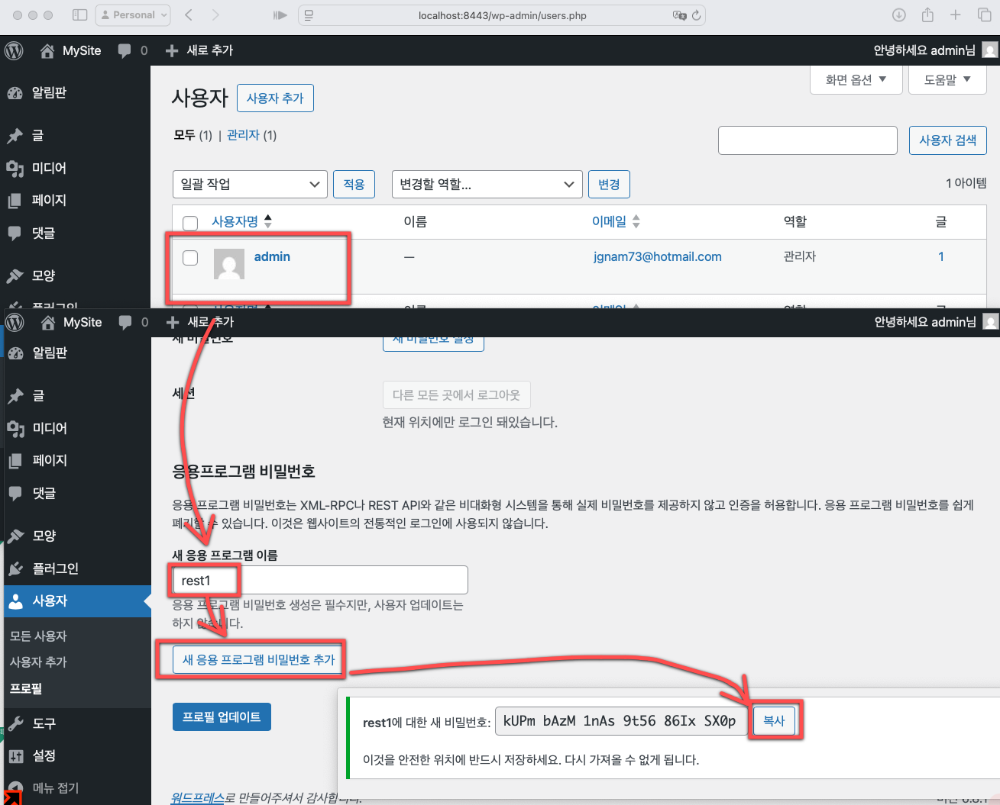
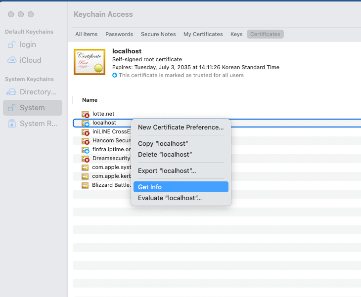
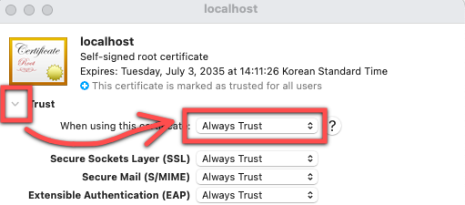

# WordPress 고급 Docker 설정

이 프로젝트는 Docker를 사용하여 WordPress와 MySQL을 자동으로 프로비저닝하는 고급 설정을 제공합니다.
단, PC나 Mac 환경에서는 WordPress 개발을 위해 Local by Flywheel이나 WP Studio와 같은 전용 개발 도구를 사용하는 것도 좋은 선택입니다. 이러한 도구들은 더 편리한 GUI 환경과 추가 기능들을 제공합니다.

## 시스템 요구사항

- Docker
- Docker Compose
- OpenSSL
- ~/.ssh/basic_pw 파일 (비밀번호 저장용)

## 설치 및 실행 방법

1. 저장소 클론:
```bash
git clone <repository-url>
cd wordpress_adv_ssl
```

2. SSL 인증서 생성:
```bash
./generate_ssl.sh
```

3. 컨테이너 시작:
```bash
./install.sh
```

## SSL 인증서 테스트

### 브라우저 테스트
1. 브라우저에서 다음 주소로 접속:
```
https://localhost:8443
```
2. 자체 서명 인증서를 사용하므로 보안 경고가 표시될 수 있습니다. 다음 단계로 진행:
   - "고급" 또는 "자세히" 클릭
   - "안전하지 않음으로 계속" 선택
   - 처음 접속 시에는 다음 단계도 필요:
     - "인증서 보기" 또는 "인증서 정보" 클릭
     - "항상 이 인증서 신뢰" 옵션 체크
     - "확인" 또는 "진행" 클릭

### 커맨드라인 테스트
curl 명령어로 SSL 연결을 테스트할 수 있습니다:
```bash
curl -v https://localhost:8443 --cacert ~/.ssh/ssl/server-cert.pem
```

이 명령어는 다음 정보를 보여줍니다:
- SSL 핸드셰이크 상세 정보
- 인증서 체인 검증 결과
- 서버 응답 내용

연결이 성공하면 다음 내용이 표시됩니다:
- SSL 핸드셰이크 완료
- HTTP 응답 헤더
- WordPress 사이트의 HTML 내용

### 문제 해결
SSL 오류가 발생할 경우:
1. 인증서 파일 존재 확인:
```bash
ls -l ~/.ssh/ssl/
```
2. 인증서 상세 정보 확인:
```bash
openssl x509 -in ~/.ssh/ssl/server-cert.pem -text -noout
```
3. 컨테이너 재시작:
```bash
docker-compose down
docker-compose up -d
```

## 주요 특징

- 자동화된 WordPress 설치 프로세스
- HTTPS 지원 (자체 서명 인증서)
- 한국어 언어팩 자동 설치
- 환경 변수를 통한 설정 관리
- 응용 프로그램 비밀번호 지원
- 개발 환경 설정
- 아키텍처 자동 감지 (ARM64/x64)

## 디렉토리 구조

- `data/contents/`: WordPress 파일이 저장되는 디렉토리
- `data/wpDb1/`: MySQL 데이터가 저장되는 디렉토리
- `data/init/`: 초기화 스크립트와 설정 파일이 저장되는 디렉토리
- `wordpress/`: WordPress 컨테이너 설정 파일들

## 환경 설정

환경 변수는 .env 파일에서 관리됩니다:
- DB_ROOT_PASSWORD: MySQL root 비밀번호
- DB_NAME: 데이터베이스 이름
- DB_USER: 데이터베이스 사용자
- DB_PASSWORD: 데이터베이스 비밀번호
- WORDPRESS_URL: WordPress 사이트 URL
- WORDPRESS_TITLE: 사이트 제목
- WORDPRESS_ADMIN_USER: 관리자 사용자명
- WORDPRESS_ADMIN_PASSWORD: 관리자 비밀번호
- WORDPRESS_ADMIN_EMAIL: 관리자 이메일

## 접속 정보

- WordPress 사이트: https://localhost:8443
- WordPress 관리자: https://localhost:8443/wp-admin
- MySQL: wpdb1
- Database Name: wordpress
- Database User: wordpress
## 응용 프로그램 비번 얻기
1. https://localhost:8443/wp-admin/users.php 접속
2. 유저 속성에서 "응용 프로그램 비밀번호" 생성
  - 

# SSL 인증서

## ~/.ssh/ssl에 SSL 인증서 생성 및 Keychain 등록
* generate_ssl.sh 스크립트를 사용하여 SSL 인증서를 생성하고 macOS Keychain에 등록합니다.
* 개발 환경에서는 자체 서명된 SSL 인증서를 사용합니다. 브라우저에서 보안 경고가 표시될 수 있으며, 이는 개발 환경에서는 무시해도 됩니다.
### 브라우저에서 보안 경고 안뜨게
* 인증서 설정 ( ~/.ssh/ssl/server-cert.pem )을 Keychain에 등록하여 브라우저에서 보안 경고를 제거할 수 있습니다.
  - 
* 인증서 속성변경 업데이트 
  - 


## cf. ssl 인증서 생성 및 Keychain 등록 방법
### 1. 디렉토리 생성
```bash
mkdir -p ~/.ssh/ssl
cd ~/.ssh/ssl
```

### 2. 사설 인증서 및 키 생성 (1년 유효)
```bash
openssl req -x509 -nodes -days 365 \
  -newkey rsa:2048 \
  -keyout server-key.pem \
  -out server-cert.pem \
  -subj "/C=KR/ST=Seoul/L=Gangnam/O=Finfra/CN=localhost"
```

### 3. 인증서 Keychain에 등록 (macOS Keychain Access에 추가)
```bash
sudo security add-trusted-cert -d -r trustRoot \
  -k /Library/Keychains/System.keychain \
  ~/.ssh/ssl/server-cert.pem
```

* `-d`: 인증서를 기본 신뢰로 설정
* `-r trustRoot`: 신뢰할 루트로 추가
* `-k`: 시스템 키체인 사용 (관리자 권한 필요)

### 4. 등록 확인 (GUI 또는 CLI)
* GUI: `Keychain Access.app` → 왼쪽 'System' 선택 → 인증서 목록 확인
* CLI:
```bash
security find-certificate -c localhost /Library/Keychains/System.keychain
```

### 5. 기타 권장 사항
* `.csr` 파일 필요 시 아래 명령으로 생성
```bash
openssl req -new -key server-key.pem -out server.csr \
  -subj "/C=KR/ST=Seoul/L=Gangnam/O=Finfra/CN=localhost"
```

* nginx나 Docker에서 사용 시 `server-key.pem`과 `server-cert.pem` 경로 마운트 필요

## 데이터 초기화

## 컨테이너 관리

컨테이너 중지:
```bash
docker-compose down
```

## 참고사항
- 이 설정은 개발 목적으로 자체 서명 인증서를 사용합니다
- 프로덕션 환경에서는 신뢰할 수 있는 인증 기관(CA)에서 발급한 인증서를 사용하는 것이 좋습니다
- 인증서는 기본적으로 10년간 유효합니다
